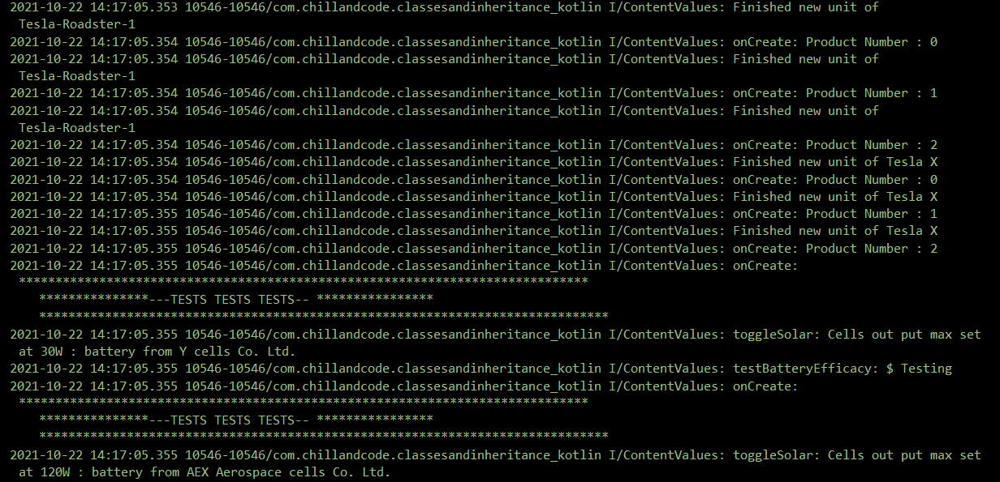

#Tesla-Cars-Class-and-Inheritance-Vehicle-Kotlin

=> Kotlin 
=> Abstract Classes,Methods 
=> Log 

A simple app to understand classes and inheritance in kotlin 
with elaborative Documentation 
Screenshot

